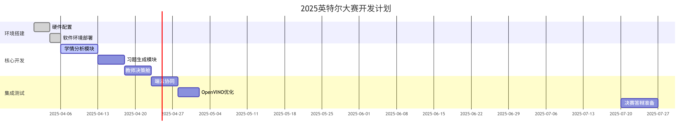
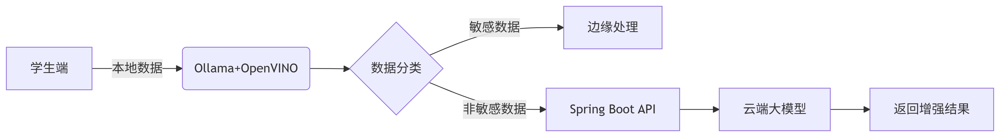

EduMind - Intelligent Education Assistant

📖 Overview
EduMind is a personalized learning and teaching assistance system designed for K12 education scenarios. By leveraging generative AI, multimodal interaction, and edge computing, it delivers three core functionalities:

Dynamic analysis of student learning progress

Adaptive exercise generation

AI-driven teaching decision support

The system addresses critical challenges in education, including resource inequality and the need for personalized instruction.

🛠 Tech Stack
Edge Side: Intel® Core™ Ultra AI PC + Arc™ GPU, Ollama, OpenVINO, IPEX-LLM

Cloud Side: Spring-AI, Python, Spring Boot, PostgreSQL, Flask

AI Models: Llama 3 7B (edge), GPT-4/Tongyi Qianwen (cloud)

Multimodal Tools: Whisper (speech), OpenCV (handwriting), Unity + OpenVINO (AR)

🏗 System Architecture
Client-Cloud Collaborative Design
Component	Technologies	Function
Edge Device	Ollama + OpenVINO + NPU	Processes sensitive data locally, generates learning reports, offline support
Cloud Services	Spring-AI + Python + PostgreSQL	Handles complex AI tasks, cross-disciplinary analysis, multi-device sync
⚡ Core Features
Dynamic Learning Profile

Analyzes homework/exams/class interactions via Pandas/Scikit-learn

Generates knowledge mastery heatmaps and personalized recommendations

Adaptive Exercise Generation

Cloud AI creates multi-difficulty exercises

Edge AI optimizes student-question matching

Supports voice/handwritten input (OpenCV formulas)

Teacher Decision Dashboard

Class performance overviews

AI lesson planning (RAG-based)

Localized deployment for data privacy

Multimodal Interaction

Voice Q&A (Whisper)

Handwriting recognition (OpenCV)

AR knowledge demos (Unity + OpenVINO)

🚀 Installation
Hardware Requirements
Intel® Core™ Ultra AI PC with Arc™ GPU

Ubuntu 22.04 + Windows dual system

Edge Setup
bash
# Install Ollama  
curl -fsSL https://ollama.com/install.sh | sh  

# Deploy OpenVINO & Llama 3  
pip install openvino-dev[onnx]==2023.3.0  
ollama run llama3:7b  
Cloud Deployment
bash
# Spring Boot + Spring-AI project  
spring init --dependencies=web,ai,postgresql my-edumind  

# Python multimodal services  
pip install flask opencv-python transformers  
📊 Dataset Preparation
Use public educational datasets (e.g., EDNet, ASSISTments) to create CSV files with:

csv
student_id,knowledge_point_id,correct_rate,timestamp  
💡 Usage Examples
Learning Analysis: Run Pandas scripts to generate heatmaps from student data

Exercise Generation: Call Spring-AI APIs with difficulty parameters

Teacher Dashboard: Access local web interface for class insights

🎯 Industry Application
Pain Point	Our Solution
Regional resource inequality	AI-powered personalized learning
Teacher overload	Automated lesson planning & grading assistance
Diverse student needs	Adaptive content generation & multimodal interaction
📈 Business Value
Monetization: School subscriptions + freemium model for individuals

Social Impact: Enhanced educational equity in remote areas

⚠️ Risk Management
Risk Type	Mitigation Strategy
Multimodal latency	OpenVINO async inference pipelines
Data privacy	Edge-local processing + federated learning updates
🔗 Resources
OpenVINO AI Courses

IPEX-LLM Optimization Guides

Empowering Educators, Personalizing Learning 🚀